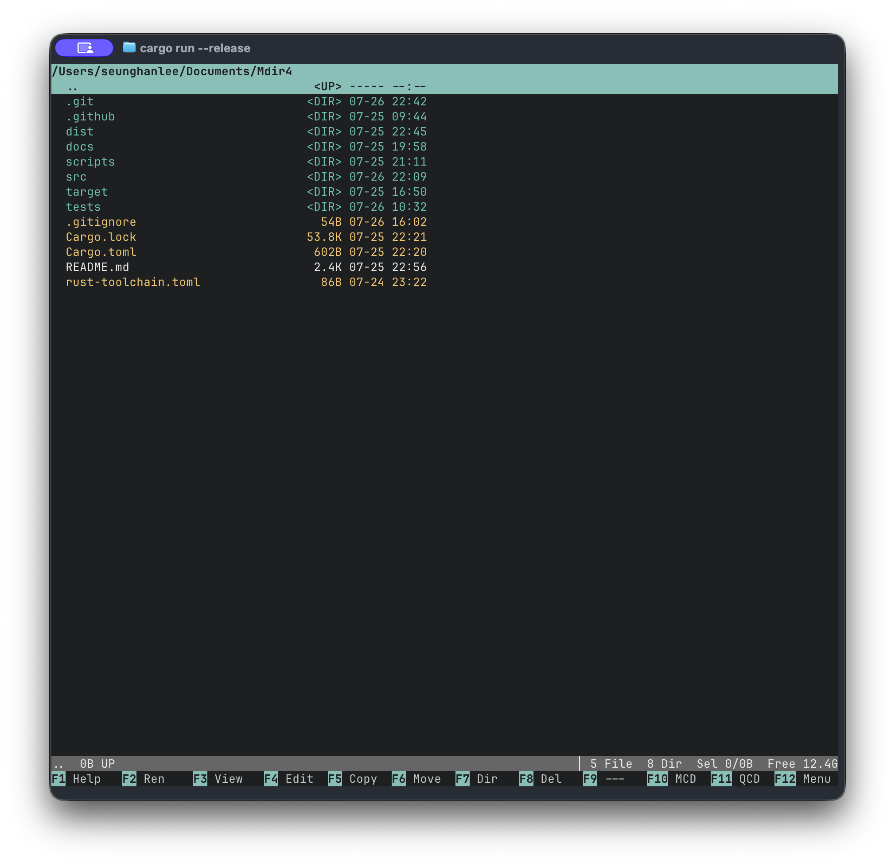
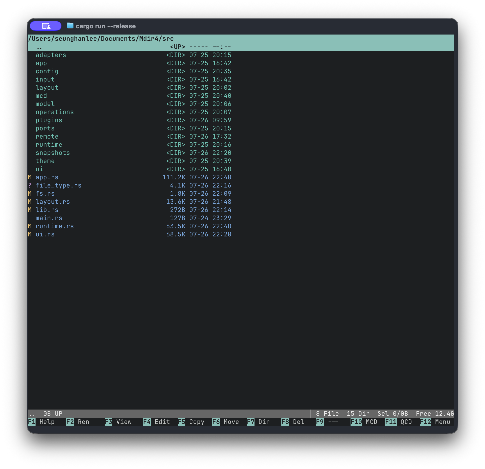

# Mdir4

**A fast, keyboard-first terminal file manager inspired by Mdir III.**

Mdir4 brings the dense, function-key-driven workflow of classic file managers to modern
macOS and Linux terminals. Browse with spatial navigation, manage files safely, and keep
your hands on the keyboard.



## Highlights

- **Adaptive directory browser** — one to six column-major columns that use the available
  terminal space, with Short and Long views.
- **Spatial keyboard navigation** — arrow keys, paging, Home/End, marks, and familiar
  function-key commands.
- **Everyday file management** — rename, view, edit, copy, move, create directories, and
  delete. Normal deletion goes to the system trash; permanent deletion requires
  `Shift+F8` and confirmation.
- **Built for real filenames** — Unicode-aware cell-width rendering, directories-first
  sorting, hidden-file filtering, and metadata fallbacks that keep a listing usable.
- **Configurable** — TOML configuration, themes, user keymaps, saved locations (QCD),
  multi-column directory navigation (MCD), and a keyboard-accessible menu.
- **Git-aware browsing** — Git status decorations and a built-in status view for local
  repositories.



## Install

### Build from source

Mdir4 uses stable Rust. The repository pins the required toolchain in
[`rust-toolchain.toml`](rust-toolchain.toml).

```sh
git clone git@github.com:beonit/mdir4.git
cd mdir4
cargo build --release --locked
```

The executable is then available at `target/release/mdir4`.

### Run

Start in the current directory:

```sh
cargo run --locked
```

Or open a directory directly:

```sh
cargo run --locked -- /path/to/directory
```

After a release build:

```sh
./target/release/mdir4 /path/to/directory
```

### Change the shell directory on exit

A terminal program cannot directly change its parent shell's working directory. Mdir4 provides
`--cwd-file` and a bash/zsh wrapper that applies the final directory after Mdir4 exits:

```sh
source /path/to/Mdir4/shell/mdir4.sh
```

Add that line to `~/.zshrc` or `~/.bashrc` to enable it permanently. The wrapper keeps the normal
`mdir4 [directory]` command name. Scripts and other integrations can use the underlying option
directly:

```sh
mdir4 --cwd-file /tmp/mdir4-last-directory /starting/directory
```

## Key bindings

| Key | Action |
| --- | --- |
| `↑` `↓` `←` `→` | Navigate items, columns, and page boundaries spatially |
| `Enter` / `Backspace` | Open an item or return to the parent directory |
| `Home` `End` / `PgUp` `PgDn` | Jump to the first/last item or previous/next page |
| `Space` / `Insert` / `Ctrl+A` | Mark an item / mark and advance / mark all |
| `R` / `S` / `Ctrl+S` / `H` | Refresh / change sort key / reverse sort / toggle hidden files |
| `Tab` | Toggle Short and Long view |
| `F1`–`F9` | Help, Rename, View, Edit, Copy, Move, Make directory, Delete, Shell command |
| `F10` / `F11` / `F12` | MCD directory tree / QCD saved locations / Menu |
| `Ctrl+G` | Open Git status for the current local repository |
| `Ctrl+Q` | Quit with confirmation |

The footer always shows the active F1–F12 commands. Press `F1` inside the app for the
context-sensitive command list.

`F9` accepts a command and runs it through `$SHELL -c` in the directory currently displayed by
Mdir4. The file-manager screen is suspended while the command runs, so interactive output and
colors are shown directly in the terminal. Press Enter or Esc after it finishes to return to Mdir4.
Submitting an empty command opens an interactive subshell instead.

## Configuration

Configuration is stored as TOML and written atomically. Use `Alt+O` to open Settings.
By default, the file is stored at:

- `$MDIR4_CONFIG`, when that environment variable is set
- otherwise `$XDG_CONFIG_HOME/mdir4/config.toml`
- otherwise `~/.config/mdir4/config.toml`

Mdir4 preserves a broken configuration as a backup and starts with defaults rather than
preventing the file manager from opening.

## Development

Run the full local quality gate before submitting a change:

```sh
cargo fmt --all -- --check
cargo clippy --all-targets --all-features --locked -- -D warnings
cargo test --all-targets --all-features --locked
```

GitHub Actions runs the same checks and creates Linux and macOS release-candidate archives
for every successful build.

## Project documentation

- [Development setup](docs/development.md)
- [Product contract and interaction rules](docs/implementation-plan/01-product-contract.md)
- [Architecture decisions](docs/architecture)
- [Documentation map](docs/README.md)

## Platform support

Mdir4 targets modern Linux terminals and macOS Terminal/iTerm-style terminals. A terminal
of at least **60×15** is required; **80×25** is the reference layout.
