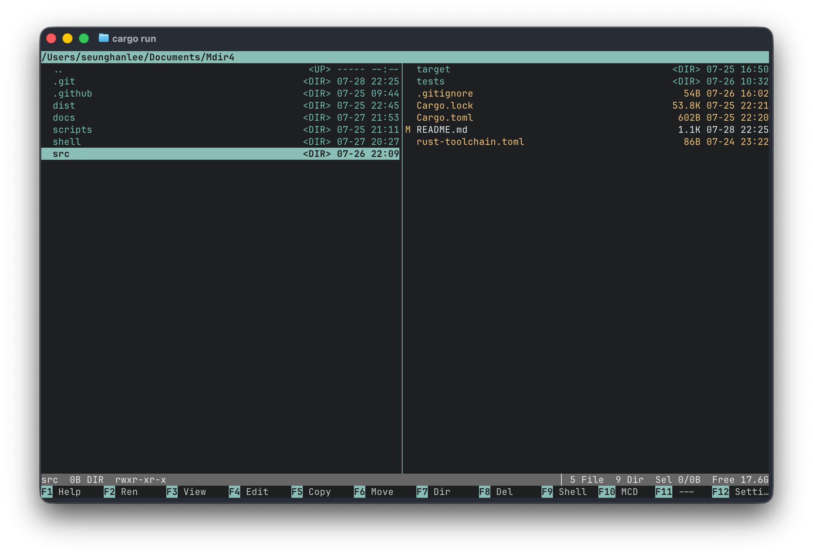

# Mdir4

Mdir4 is a fast, keyboard-first terminal file manager inspired by Mdir III. It brings a
dense classic file-manager workflow to modern macOS and Linux terminals while keeping
navigation, file operations, and project tooling close at hand.



## Highlights

- Adaptive one- to six-column directory browser with Short and Long views.
- Spatial keyboard navigation, filename type-ahead, marking, and safe file operations.
- Git-aware browsing with file status markers, diffs, commits, amend, and stash actions.
- Built-in Favorites, Amazon Build, and Git modes for project-focused workflows.
- Configurable themes, sorting, hidden-file display, and keymaps through TOML.
- Unicode-aware rendering and file metadata display, including permissions.

## Build

Mdir4 uses stable Rust; the required toolchain is pinned in
[`rust-toolchain.toml`](rust-toolchain.toml).

```sh
git clone git@github.com:beonit/mdir4.git
cd mdir4
cargo build --release --locked
```

The executable is available at `target/release/mdir4`. To run from the checkout:

```sh
cargo run --locked
```
